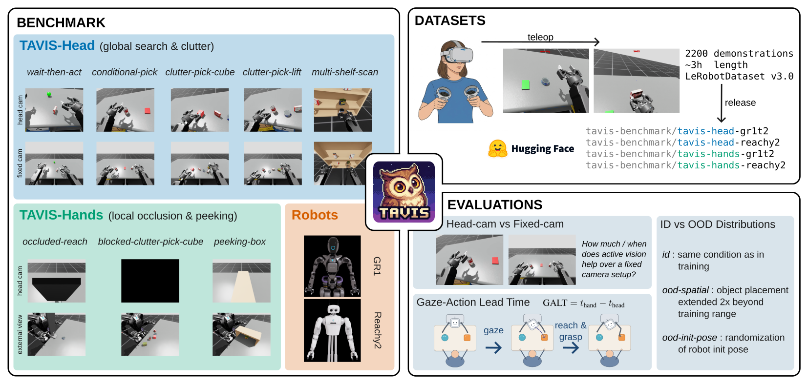

# TAVIS

<p align="center">
  
</p>

**T**orso **A**ctive **V**ision **I**mitation-learning **S**uite — a
benchmark for egocentric active-vision imitation learning and anticipatory 
gaze on humanoid torsos. TAVIS provides eight simulated manipulation 
tasks across two robots (Fourier GR1T2 and Pollen Reachy 2), 2200 VR-teleoperated
demonstrations in total, pretrained π₀ baselines, and a
proprioceptive metric — **GALT (Gaze–Action Lead Time)** — for
quantifying anticipatory gaze in the resulting policies.

> *Paper: under review*.

## What TAVIS evaluates

TAVIS is designed to support evaluative claims about:

* **Active vision in IL** — whether and how head-mounted egocentric
  cameras improve task performance over fixed-camera baselines, on
  tasks that can benefit from gaze behavior.
* **Anticipatory gaze** — whether a policy reproduces the *temporal*
  structure of head-before-hand seen in human demonstrations
  (measured by GALT, in seconds), not just the spatial endpoints.
* **Shared task/action design across embodiments** — the same tasks run
  on both humanoid torsos with a canonical 19-D action layout. The
  released results treat the robots as separate benchmark axes rather
  than claiming zero-shot policy transfer between them.

Each (robot × task × eval-mode) cell is evaluated over 96 stochastic
episodes; success rates are reported with Wilson 95 % confidence
intervals. See `docs/ood_modes.md` for the eval-mode taxonomy.

## Resources

| Resource                    | Location                                       |
|-----------------------------|------------------------------------------------|
| Datasets (LeRobot v3.0)     | https://huggingface.co/tavis-benchmark         |
| Pretrained π₀ checkpoints   | https://huggingface.co/tavis-benchmark         |
| Robot / task USD assets     | https://huggingface.co/datasets/tavis-benchmark/tavis-assets |
| Quest teleoperation APK     | published under Releases                       |

## Hardware requirements

* **Simulation / data collection / evaluation:** an NVIDIA GPU with
  ray-tracing support (RTX 4090, A6000, L40, …). RTX is required at
  rendering time.
* **Training:** any modern NVIDIA GPU. Diffusion-policy fits on a
  single 24 GB card; π₀ training fits on an H100; π₀-LoRA fits on a
  single 24 GB card.
* **Teleoperation:** a Meta Quest 2 / 3 with developer mode enabled.

## Installation

The repository ships an installer script that bootstraps the full
pinned stack (see install.sh for exact versions) into a fresh
`tavis` conda env on Python 3.11:

```bash
git clone <this-repo-url>
cd tavis
bash install.sh
conda activate tavis
```

Override defaults via env vars:

| Variable             | Default   | Notes                                            |
|----------------------|-----------|--------------------------------------------------|
| `TAVIS_ENV_NAME`     | `tavis`   | Conda env name.                                  |
| `TAVIS_INSTALL_DIR`  | `$HOME`   | Where IsaacLab and IsaacLab-Arena are cloned.    |
| `TAVIS_TORCH_CUDA`   | `cu128`   | Torch wheel; `cu130` also valid.                 |

Requirements: `conda`, `git`, and an NVIDIA GPU with matching CUDA drivers.
The script aborts if the conda env or target clone directories already
exist — remove them or override the env vars to retry.

> **Paper-version note.** Paper results were originally produced with
> Isaac Sim 4.5 / Python 3.10 / IsaacLab v2.1.1. The current installer
> targets Isaac Sim 5.1 — same code path, with fixes applied for
> upstream API changes.

> **Note.** Plain `pip install -e .` will not install correctly:
> `install.sh` uses `uv` to apply dependency overrides defined in
> `pyproject.toml` (e.g. excluding `rerun-sdk` to keep `numpy<2`
> for IsaacLab's pinocchio). See `install.sh` for the full pinned
> stack and override mechanism.

## Quick start: reproduction recipes

### A) Run a pretrained multi-task policy across the whole TAVIS-HEAD suite

This is the fastest path for quick testing: no training, just download a
checkpoint and run rollouts. All five TAVIS-HEAD tasks × `id` and
`ood_spatial` modes × 96 episodes each = 960 episodes per robot.
Expect several hours on a single 4090.

```bash
# Download a multi-task π₀ checkpoint (head-mounted-camera variant):
huggingface-cli download tavis-benchmark/pi0-tavis-head-gr1t2-headcam \
    --local-dir checkpoints/pi0-tavis-head-gr1t2-headcam

# Run the whole TAVIS-HEAD suite:
python scripts/eval_benchmark.py \
    --checkpoint checkpoints/pi0-tavis-head-gr1t2-headcam \
    --suite tavis-head --robot gr1t2 \
    --episodes 96 --num-envs 1

# Aggregate the per-(task, eval-mode) JSONs into one summary table:
python scripts/print_benchmark_results.py results/pi0-tavis-head-gr1t2-headcam
```

`eval_benchmark.py` writes one JSON per `(task, eval-mode)` combination
under `results/<checkpoint-name>/`. Each file contains the per-episode
success flags and the per-episode GALT values; `print_benchmark_results.py`
aggregates those into an ASCII table with Wilson 95 % CIs.

Pretrained π₀ checkpoints available on Hugging Face:

| Repo                                              | Robot   | Suite        | Camera     |
|---------------------------------------------------|---------|--------------|------------|
| `tavis-benchmark/pi0-tavis-head-gr1t2-headcam`    | GR1T2   | TAVIS-HEAD   | head       |
| `tavis-benchmark/pi0-tavis-head-gr1t2-fixedcam`   | GR1T2   | TAVIS-HEAD   | fixed      |
| `tavis-benchmark/pi0-tavis-head-reachy2-headcam`  | Reachy2 | TAVIS-HEAD   | head       |
| `tavis-benchmark/pi0-tavis-head-reachy2-fixedcam` | Reachy2 | TAVIS-HEAD   | fixed      |
| `tavis-benchmark/pi0-tavis-hands-gr1t2`           | GR1T2   | TAVIS-HANDS  | head       |
| `tavis-benchmark/pi0-tavis-hands-reachy2`         | Reachy2 | TAVIS-HANDS  | head       |

### B) Train and evaluate a single-task diffusion policy from scratch

Lightweight, end-to-end runnable on a single GPU overnight (~12 h on a 4090).
Reproduces one task cell of the paper.

The released TAVIS datasets are *multi-task suites* (one per
robot × suite) with a recorded `task` field per episode. The training
script's `--task` flag filters the suite down to a single task class:

```bash
# 1. Download the multi-task TAVIS-HEAD dataset for GR1T2:
huggingface-cli download tavis-benchmark/tavis-head-gr1t2 \
    --repo-type dataset \
    --local-dir datasets/tavis-head-gr1t2

# 2. Train a diffusion policy on a single task within the suite
#    (200000 steps matches the per-task diffusion runs reported in the paper):
python scripts/train_policy.py \
    --dataset datasets/tavis-head-gr1t2 \
    --task conditional_pick \
    --model diffusion --camera headcam \
    --steps 200000

# 3. Evaluate the resulting checkpoint:
python scripts/eval_benchmark.py \
    --checkpoint checkpoints/tavis-head-gr1t2__conditional_pick_diffusion_headcam \
    --robot gr1t2 --tasks conditional_pick \
    --eval-modes id ood_spatial \
    --episodes 96 --num-envs 1

# 4. Print the summary:
python scripts/print_benchmark_results.py \
    results/tavis-head-gr1t2__conditional_pick_diffusion_headcam
```

`--task` accepts either a snake-case key
(`clutter_pick_lift`, `conditional_pick`, …) or the recorded class
name (`ClutterPickLiftTask`).

### Multi-task π₀ training from scratch

Multi-task training is π₀ only; π₀ uses the per-episode language
instruction to disambiguate which task it has been asked to do.

Drop `--task` from recipe B and switch to π₀:

```bash
python scripts/train_policy.py \
    --dataset datasets/tavis-head-gr1t2 \
    --model pi0 --camera headcam \
    --steps 30000      # ← match the paper's per-suite π₀ step count
```

The multi-task π₀ runs reported in the paper used H100-days of compute
and an external SLURM orchestrator that is not part of this repo. For
reviewers, the released multi-task π₀ checkpoints (recipe A) are the
practical reproduction path.

Available multi-task datasets:

| Repo                                  | Robot   | Suite        | Episodes |
|---------------------------------------|---------|--------------|----------|
| `tavis-benchmark/tavis-head-gr1t2`    | GR1T2   | TAVIS-HEAD   | 800      |
| `tavis-benchmark/tavis-head-reachy2`  | Reachy2 | TAVIS-HEAD   | 800      |
| `tavis-benchmark/tavis-hands-gr1t2`   | GR1T2   | TAVIS-HANDS  | 300     |
| `tavis-benchmark/tavis-hands-reachy2` | Reachy2 | TAVIS-HANDS  | 300     |

## Explore the demonstration data

The fastest way to inspect a TAVIS dataset is the LeRobot web
visualiser, which streams from Hugging Face without downloading the
full dataset:

* `https://huggingface.co/spaces/lerobot/visualize_dataset` —
  paste a TAVIS dataset name (e.g.
  `tavis-benchmark/tavis-head-gr1t2`) and pick an
  episode.

For local inspection of a specific episode (still streamed; no full
download):

```bash
python -m lerobot.scripts.visualize_dataset \
    --repo-id tavis-benchmark/tavis-head-gr1t2 \
    --episode-index 0
```

The Hugging Face files browser additionally shows the recorded
videos directly; click any MP4 in the dataset's *Files and versions*
tab.

## Documentation

| Topic                                  | File                       |
|----------------------------------------|----------------------------|
| GALT metric and porting to your robot  | `docs/galt.md`             |
| Adding a new robot                     | `docs/extending_robots.md` |
| Adding a new task                      | `docs/extending_tasks.md`  |
| Evaluation modes (`id`, `ood_*`)       | `docs/ood_modes.md`        |
| Data collection (VR teleoperation)     | `docs/data_collection.md`  |

The GALT detector consumes only a 19-D commanded-action trajectory (arm EE
positions + head joints + gripper scalars), so it ports to any robot
with those channels by overriding a single `ActionLayout` dataclass.
This is the part of the codebase most likely to be useful outside
the TAVIS suite itself.

## Repository layout

```
tavis/
├── tavis/
│   ├── robots/                      # GR1T2, Reachy2 embodiments
│   ├── tasks/                       # 8 task definitions
│   ├── eval/                        # GALT detector + benchmark eval core
│   ├── benchmark/                   # Suite definitions
│   ├── wrappers/                    # CanonicalFrame, InitPose, experiment
│   ├── teleop/                      # Quest TCP server + main loop
│   ├── controllers/                 # Null-space IK
│   ├── actions/                     # Custom action terms (e.g. gripper mimic)
│   ├── mdp/                         # Observation terms
│   ├── make_env.py                  # The single env-construction entry point
│   └── download_assets.py           # HF asset fetcher
├── scripts/
│   ├── teleop_main.py               # Run VR teleoperation + dataset recording
│   ├── train_policy.py              # DP / ACT / SmolVLA / π₀ training
│   ├── eval_policy.py               # Single-task eval with optional GUI
│   ├── eval_benchmark.py            # Formal, full benchmark eval
│   └── print_benchmark_results.py   # Aggregate eval JSONs into ASCII tables (Wilson CIs)
├── quest_app/                       # Meta Quest Unity project
├── docs/                            # Per-topic documentation
├── install.sh                       # One-shot env + pinned-deps installer
├── pyproject.toml
└── LICENSE
```

## License

* Code: MIT (see `LICENSE`).
* Datasets: CC-BY-4.0, released under `tavis-benchmark/` on Hugging
  Face.
* Robot models, YCB objects, and task assets: as licensed by their
  respective upstream sources (NVIDIA IsaacLab, the YCB project, and
  the original robot-model authors). Per-asset attribution is
  shipped alongside the assets on Hugging Face.

## Citation

[COMING SOON]

The BibTeX entry will be updated to point at the published version
once review concludes.

## Contact

Questions, bug reports, and contributions are welcome:
`tavis.benchmark@gmail.com`.

## Acknowledgments

TAVIS is built on top of [IsaacLab](https://isaac-sim.github.io/IsaacLab/)
(NVIDIA), the [LeRobot](https://github.com/huggingface/lerobot)
imitation-learning framework (Hugging Face), and IsaacLab-Arena. The
robot models are sourced from the upstream Fourier GR1T2 and Pollen
Reachy 2 USD distributions; the YCB objects come from the YCB
project. The Meta Quest hardware and SDK are used for VR
teleoperation.
